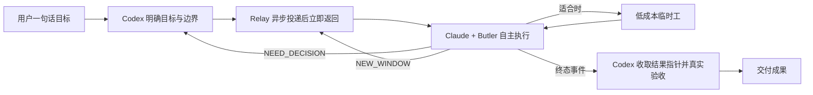

# Codex 自动管家接力器

一个事件优先、轻量、跨模型的 Goal Loop：用户只向 Codex 说明目标，Codex 用 `goal-capsule-v1` 把最小目标交给前台 Claude Code 后立即结束当前回合；Claude 加载 Butler 后自主执行；Relay 在终态原子写入 `butler-event-v1` 并通知，Codex 只在终态或远期 watchdog 时被唤醒。

它解决的不是“如何让模型遵守更多流程”，而是“如何用最少的协调成本，让不同价位模型完成同一个项目”。

## 为什么这样设计

大模型已经能拆任务、选工具和处理普通异常。把这些能力重新写成几十条检查点，会产生四种反效果：

- 初始 Goal 过长，真正目标被流程文本淹没。
- Claude 为证明合规而强制拆分、派发和汇报。
- Codex 反复轮询、审批和转述进度，浪费高价值上下文。
- 多层转述增加延迟，并让事实、字段和数值逐步失真。

因此本项目只硬约束机器无法靠默契解决的接口：

1. **目标**：要完成什么。
2. **边界**：用户明确的权限、禁区和验收标准。
3. **终态**：`GOAL_DONE`、`NEED_DECISION`、`NEW_WINDOW`。

任务拆分、工具选择、模型路由和过程节奏交给 Claude 自主判断。临时工不是 KPI：只有经济上划算且结果可验证时才调用。

## 最小工作流



理想状态下，Codex 只高强度工作两次：开始时把目标讲清楚，结束时验证成果。运行中没有新信息，因此不轮询；独立 Relay 进程本地等待终态。当前 Codex App 尚无供独立进程调用的稳定 thread callback，所以只保留 6 小时 watchdog，仍运行则退到 24 小时，并以 macOS 通知作为即时提醒。

## 核心能力

- **前台真实交互**：启动 Terminal 中可见、可观察的 Claude Code TUI，不使用 `-p` 模拟交互。
- **自动转发与续接**：新 Goal 新建 session；后续任务续接同一 session，避免重复加载 Butler。
- **自动处理常规阻塞**：识别首次目录信任提示，使用 Claude `auto` permission mode 处理项目内常规操作。
- **可靠长文本投递**：按 UTF-8 字节安全分块，并以 transcript marker 确认消息确实送达。
- **窄腰 Goal Capsule**：只传 intent/outcome、明确边界、验收标准和权威文件锚点，不替 Claude 预拆任务。
- **事件优先监测**：`--detach` 派发后立即返回；运行中不向 Codex 传递 `GOAL_RUNNING`。
- **最小终态事件**：原子写入 `butler-event-v1`，只含 `goal_id`、signal、结果路径和 SHA-256，详细内容不重复搬运。
- **远期 watchdog**：首次 6 小时，仍运行则 24 小时；仅用于防止终态事件丢失，不作为正常进度轮询。
- **终态通知**：事件写入后立即发送 macOS 通知；不使用 AppleScript UI 模拟 Codex callback。
- **安全换窗**：context 质量下降时自动携带交接信息开启新窗口，并关闭被替换的 Relay screen。
- **不限运行时间**：大项目耗时长是正常现象；进程健康时不以时间判失败。

## 安装

要求：macOS、Python 3.10+、Claude Code、GNU screen，以及 Claude 中可用的 `/butler` Skill。

```bash
git clone https://github.com/xiaogege6697/codex-butler-relay.git
cd codex-butler-relay
uv tool install .
butler-relay --check
```

将仓库中的 `skills/butler-relay` 安装到 Codex Skills 后，可以直接说：

> 打开接力器，把这个任务交给 Claude，做好后直接给我成果。

## 使用

```bash
# 异步启动新 Goal，并打开真实 Claude TUI；命令立即返回
butler-relay --detach --goal --project /path/to/project "目标、边界与验收标准"

# 终态或远期 watchdog 时执行；运行中只返回下一次 watchdog 间隔
butler-relay --collect --project /path/to/project

# 异步续接当前项目
butler-relay --detach --project /path/to/project "下一阶段任务"

# 仅在用户明确查询或已有故障证据时查看状态
butler-relay --status --project /path/to/project

# Codex 真实验收通过后标记完成
butler-relay --accept --project /path/to/project

# 用户明确要求后台运行时才使用
butler-relay --headless --project /path/to/project "任务文本"
```

可见模式会启动本机 Terminal 与 GNU screen。在带进程沙箱的 Codex 环境中，启动命令需要获得针对 Terminal/后台 screen 的本地执行许可；若沙箱内 screen 启动后立即消失，应以同一命令申请该窄权限重试，不要切换模型或改用 UI 自动化。

状态只写入目标项目根目录的 `.butler-relay.json`；后台结果、终态事件和日志写入 `~/.cache/codex-butler-relay/`，不污染项目源码。终态事件只保存结果指针和摘要，不复制完整成果。Claude transcript 仍由 Claude Code 自己管理。

不加 `--detach` 时仍保留原同步行为，供手动 CLI 调试使用。Codex Skill 默认只使用异步模式。

## 三个终态信号

| 信号 | 含义 | 后续动作 |
|---|---|---|
| `GOAL_DONE` | Claude 认为目标已完成 | Codex 检查真实文件、测试和用户可见结果 |
| `NEED_DECISION` | 存在无法自行决定的关键取舍 | Codex 决策；只有真正影响用户意图时才询问用户 |
| `NEW_WINDOW` | context 已开始影响质量 | Relay 把完整交接内容发送到新 Claude session |

## 设计边界

Relay 不做任务拆分、模型路由、数据库、Dashboard、成本报表或复杂状态机。它只负责：启动、投递、续接、等待终态和换窗。

Relay 不会尝试用非官方方式启动第二条 Codex 模型链，也不会用 UI 自动化伪造 thread callback。Codex App 只设置远期 watchdog；其他环境使用 macOS 通知和手动 `--collect`。

Claude 与 Butler 负责执行策略；临时工可以是 MiMo、DeepSeek 或任何可用且便宜的模型。Codex 不在线“盯过程”，而是拥有目标与最终裁决权。

## 维护契约

如果你想改造或接入 Relay，先读 [docs/relay-contract.md](docs/relay-contract.md)。这份文档固定的是稳定接力契约：

- `.butler-relay.json` 中哪些状态字段有兼容性意义；
- `starting`、`running`、`awaiting_acceptance`、`needs_decision` 等状态如何流转；
- `GOAL_DONE` 为什么只是验收入口，而不是完成证据；
- `--collect` 为什么只做低频终态检查，不读取项目、不复述普通进度；
- 出现 `RELAY_FAILED`、协议错误或 screen 丢失时如何恢复。

仓库中的 [evals/evals.json](evals/evals.json) 给出 10 个回归场景，用来防止项目重新漂移成重型调度器、普通轮询器或强制外包流程。

## 验证

```bash
python3 -m unittest -v
butler-relay --check
```

当前验证分三层：

1. 38项单元测试覆盖signal识别、UTF-8分块投递、transcript marker、换窗、detached worker、终态事件、摘要校验与幂等`--collect`。
2. 评估场景覆盖Goal Loop契约、静默运行态、协议错误和不强制临时工。
3. `0.4.0`真实前台只读Goal已验证：异步派发后约20秒产生`GOAL_DONE`事件，`goal_id`、结果路径与SHA-256均通过验证，全程没有中间态轮询或临时工调用。

这个结果也说明：**轻任务不应为了展示多模型协作而强制外包。**

## License

MIT
